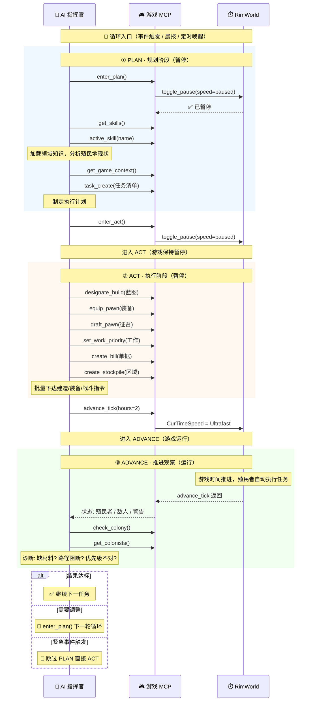

# RimWorldAgent

AI Colony Runtime — AI 自主管理殖民地。通过 MCP 协议连接 RimWorldMCP，集成 Claude Agent SDK。

**相关项目**:
- MCP Server: `../RimWorldMCP/`（游戏 Mod DLL，99+ Tool）
- MCP 协议库: `../SimpleMspServer/`（JSON-RPC + SSE Transport）
- CC Companion: `./cc-companion/`（Node.js，CCB 桥接）

## 项目结构

```
RimWorldAgent/
├── CLAUDE.md
├── RimWorldAgent.csproj       ← 单一项目 (net472, OutputType=Exe)
├── README.md
├── resource/                  ← MOD 元数据（构建时复制到根 publish）
│   ├── About/About.xml
│   ├── About/*.bbcode          ← Steam 创意工坊描述
│   └── Skills/*.md             内置 Skill 文档
├── Skills.d/                   ← 用户/AI 创建 Skill（运行时同级，可覆盖内置）
├── Core/                      ← 共享逻辑
│   ├── AgentRuntime/
│   │   ├── AgentLoop.cs / AgentOrchestrator.cs / ToolDispatcher.cs
│   │   ├── IGameStateProvider.cs  ★ 游戏状态抽象接口（tick/paused/早报/wake）
│   │   ├── SdkMessageParser.cs    ★ SDK → UiMessage 转换
│   │   ├── InternalToolRegistry.cs ★ 内部工具注册 + Skill 加载（IToolProvider）
│   │   └── Tools/                 7 个内部工具 + ProxyToolProvider
│   ├── models/                  ★ 类型定义 — SdkMessage / UiMessage / ChatChannel
│   │   ├── SdkMessage.cs          SDK 消息模型 + 内容块 + 辅助类型
│   │   └── SdkSystemMessages.cs   System 消息子类（15 subtype × 1 兜底）
│   │   └── NativeResolver.cs    ★ 原生 DLL 搜索路径设置
│   ├── Data/                    ★ 数据抽象层 — IDbStore + IConversationStore (ConversationEntry / MemoryConvStore / SqliteConvStore / UiHistoryFormatter)
│   ├── Mcp/                     MCP 客户端 + Agent MCP Server (:9878)
│   ├── CcbManager/              CCB 子进程管理 + CcbWebSocket + TokenUsageTracker
│   └── UIMessageBus.cs          ★ UI 总线 — Fleck WS :19999
├── Exe/                         ← EXE Loader
│   └── Program.cs               入口：JsonDbStore + RemoteGameStateProvider → AgentEngine 构造注入
├── Mod/                         ← MOD Loader (RimWorld 加载)
│   ├── GameComponent_RimworkAgent.cs   GameComponent 生命周期 + Agent 初始化 + UIMessageBus 启动
│   ├── CompanionInstaller.cs           npm install 管理 + Node.js 查找
│   ├── ScribeDbStore.cs                Token 数据 Scribe 持久化
│   ├── DirectGameStateProvider.cs      MOD 模式 — 直接从 Find.TickManager 读取 tick/paused
│   └── AgentModSettings.cs / RimWorldAgentMod.cs   Mod 设置 UI
├── cc-companion/                ← CCB 桥接 (Node.js, npm start)
└── publish/                     ← 构建输出 (git ignored)
```

## 架构

### 零引用设计

RimWorldAgent 和 RimWorldMCP **互不引用**，仅通过 MCP 协议通信。

```
RimWorldAgent (EXE/MOD)             RimWorldMCP (Mod DLL)
┌──────────────────────┐           ┌──────────────────────┐
│ AgentEngine          │   HTTP    │ MCP Server :9877     │
│ McpClient ───────────── POST ───→ /mcp (tools/call)    │
│ McpClient ───────────── GET ────→ /sse (tick 推送)     │
│ AgentMcpServer :9878  ←───────── SDK tools/call         │
│ CcbManager ── spawn ──→ cc-companion (Node.js :19998)  │
└──────────────────────┘           └──────────────────────┘
```

### 两种启动模式

| 模式 | 进程 | IDbStore | IConversationStore | IGameStateProvider |
|------|------|----------|-------------------|-------------------|
| **EXE** | `RimWorldAgent.exe` | `JsonDbStore`（JSON 文件） | `SqliteConversationStore`（Microsoft.Data.Sqlite） | `RemoteGameStateProvider`（MCP 推送 + 查询） |
| **MOD** | RimWorld 加载 DLL | `ScribeDbStore`（Scribe_Values） | `SqliteConversationStore`（Microsoft.Data.Sqlite，原生 DLL 在 Native\） | `DirectGameStateProvider`（TickManager 直读） |

### DB 存储抽象 — IDbStore

Token 数据存储接口（`Core/Data/IDbStore.cs`）。

```csharp
public interface IDbStore
{
    string CurrentModel { get; set; }
    void Record(string model, long input, long output, long cacheRead, long cacheCreate, long durationMs);
    void RecordToolResult(bool isError);
    // 累计属性
    long TotalInputTokens { get; } long TotalOutputTokens { get; }
    long TotalCacheReadTokens { get; } long TotalCacheCreateTokens { get; }
    long TotalAllTokens { get; } int TotalRequests { get; }
    int TotalToolSuccess { get; } int TotalToolFailure { get; }
    long TotalDurationMs { get; }
    Dictionary<string, TokenModelUsage> GetModelUsages();
    void Clear(); event Action? OnRecorded;
    // 持久化
    string GetCompactDisplay(long budgetLimit);
    string GetSummary();
}
```

`TokenUsageTracker` 保留为静态门面，`AgentEngine.InitAsync` 中 `TokenUsageTracker.Db = _dbStore` 注入。

### 游戏状态抽象 — IGameStateProvider

```csharp
public interface IGameStateProvider
{
    int GameTick { get; }
    int GameDay { get; }
    int GameHour { get; }
    bool IsPaused { get; }
    bool ShouldMorningReport();       // GameHour>=6 && GameDay>_lastMorningDay
    void MarkMorningReportSent();
    bool ShouldWake(int intervalGameHours);
    Task SyncGameStatusAsync();       // Remote=调MCP, Direct=读TickManager
}
```

| 实现 | tick 来源 | paused 来源 |
|------|----------|------------|
| `RemoteGameStateProvider` | MCP `OnGameTick` 推送 | MCP `get_game_speed` 查询 |
| `DirectGameStateProvider` | `Find.TickManager.TicksGame` | `Find.TickManager.Paused` |

`AgentEngine` 构造注入两者，`TickAsync` 通过 `_gameState.SyncGameStatusAsync()` 统一刷新。无类型判断。

### Agent 调度循环 (TickAsync, ~2s)

```
SyncGameStatusAsync() → 刷新 tick + paused
├─ 优先 0: 冷启动检测 — HasEverSent=false 时 get_game_speed 检查游戏就绪 → RunAgent
├─ 弹框扫描 (2500 tick)
├─ 状态检测 (120 tick, 仅空闲)
│   ├─ 暂停提醒 (>30s / 每 60s)
│   └─ 早报防抖 (GameHour>=6, 每天只发一次)
├─ 优先 1: 中断处理 → 等待 AgentLoop 中 SendAbort
├─ 优先 2: 中断 + 空闲 → 立即启动新会话
├─ 优先 3: 每日 PLAN (ShouldMorningReport) → EnterPlanPhase + PauseForPlanning → RunAgent
└─ 优先 4: 定期 ACT (ShouldWake) → RunAgent
```

### 协议 (Protocol)

项目有 4 个消息层，每层有独立的消息格式。

---

#### 层 1：CcbWebSocket ↔ Companion (WS :19998)

仅 4 种消息，C# `SendChat`/`SendAbort` 直发顶层 type，不经过包装。

| 方向 | type | 字段 | 说明 |
|------|------|------|------|
| C# → | `chat` | `text` (string), `session` ("bus"\|"system"), `thinking` ({mode,effort,tokens?}) | 用户消息或系统 prompt |
| C# → | `abort` | (无) | 中断当前 SDK 会话 |
| ← C# | `hello-ok` | (无) | 握手确认 |
| ← C# | `assistant` | `message.content[]` (text/tool_use/thinking), `usage`, `model`, `stop_reason` | 完整 AI 回复 |
| ← C# | `stream_event` | `event` (content_block_start/delta), `index` | 流式增量（text_delta/thinking_delta） |
| ← C# | `result` | `subtype` (success/error_*), `stop_reason`, `duration_ms`, `usage`, `num_turns` | 会话结束 |
| ← C# | `system` | `subtype` (init/compact_boundary/status/...), 各子类型字段 | 系统消息 |
| ← C# | `user` | `message.content[]`, `parent_tool_use_id`, `isSynthetic` | SDK 回显的用户消息 |
| ← C# | `aborted` | (无) | 中断确认 |

C# 侧：`CcbWebSocket.ReceiveLoop` → `SdkMessage.FromJson` → `OnSdkMessage` 事件 → `SdkMessageParser` → `UiMessage`。

---

#### 层 2：UIMessageBus (WS :19999)

##### Agent → UI（推送）

所有消息继承 `UiMessage` 基类，`ToJson()` 序列化后 WS 广播。

```
┌────────────────────────────────────────────────────────────────────────────────────────────┐
│ RimWorld AI 指挥官                                                                         │
│ 冰盖 · 1年 夏第5天                                        入 12K/200K 6% │ Tok 43K/200K 85% │ 缓存 12K 35% │
├────────────────────────────────────────────────────────────────────────────────────────────┤
│ ── 对话 ──                                                     │ ── 工具调用 ──                                 │
│ [你] 查看殖民地状态                                            │ #1 [OK] get_colony (1.2s)                      │
│ [思考] 让我想想接下来的安排...                                 │ #2 [..] search_items                           │
│ [AI] 下一步建议：扩大种植区。                                  │ #3 [OK] read_memory (0.5s)                     │
│                                                                │ ── 任务 ──                                     │
│                                                                │ [>] 补全字段                                   │
│                                                                │ [ ] 修复编译错误                               │
├────────────────────────────────────────────────────────────────────────────────────────────┤
│ > 查看所有殖民者的健康状态______________ [发送]                                                            │
├────────────────────────────────────────────────────────────────────────────────────────────┤
│ * 已连接 | ACT / 运行 | [压缩中] | 透明 [-] [+] | 清空 继续 中断                                           │
└────────────────────────────────────────────────────────────────────────────────────────────┘
```

| type | C# 类 | 字段 | 渲染位置 |
|------|-------|------|---------|
| `text_delta` | `UiTextDelta` | `text` | 左栏·对话流（空串=新条目开始） |
| `thinking_delta` | `UiThinkingDelta` | `thinking` | 左栏·"思考"标签 + 橙色文本 |
| `tool_call` | `UiToolCall` | `id`, `name`, `input` | 右栏上·工具卡片（[OK]/[..]/[XX] 状态） |
| `tool_result` | `UiToolResult` | `id`, `isError`, `durationMs`, `content?` | 右栏上·卡片状态+耗时更新 |
| `result` | `UiResult` | `subtype`, `stop_reason` | 结束流式条目 |
| `aborted` | `UiAborted` | (无) | 流式条目追加"（已中断）" |
| `system_init` | `UiSystemInit` | `model`, `session_id` | 内部使用 |
| `user` | `UiUser` | `text` | 左栏·新建 [你] 条目 |
| `system` | `UiSystem` | `text` | 左栏·[系统] 条目 |
| `budget_status` | `UiBudgetStatus` | `used`, `limit`, `action`, `cacheRead`, `totalInput`, `cacheCreate`, `contextWindow`, `inputTokens` | header 三指标 |
| `agent-status` | `UiAgentStatus` | `role` | 底栏 "ACT / 运行" |
| `compaction-status` | `UiCompactionStatus` | `active` | 底栏 "[压缩中]" |

##### UI → Agent（客户端消息）

| type | 字段 | 说明 |
|------|------|------|
| `chat` | `text`, `thinking?` ({mode,effort,tokens?}) | 用户发送消息 |
| `abort` | (无) | 中断当前会话 |
| `history` | `n` | 请求最近 N 条历史消息（初始加载） |
| `history_before` | `before_id`, `n` | 请求指定 ID 之前的更早消息（向上滚动） |

C# 侧：`UIMessageBus.OnMessage` → `OnChat`/`OnAbort`/`OnHistory`/`OnHistoryBefore` 事件 → `AgentLoop.WireUIMessageBus`。
`IConversationStore` 由 EXE/MOD 在 `WireUIMessageBus` 前注入 `AgentLoop.ConversationStore`。
录制点（**C# 侧统一，SDK 不回传 user echo**）：
- `OnChat` → `RecordUserMessage` + `PushUiMessage(User)`（用户消息：落盘+推送）
- `SdkMessageParser.ParseAssistant` → `OnAssistantContent` → `RecordAssistantMessage`（AI 回复 text+thinking）
- `SdkMessageParser` tool_use block → `OnToolCallRecorded` → `RecordToolCall`
- `AgentLoop.OnToolUse` (Stopwatch 计时) + `SdkMessageParser` tool_result block → `OnToolResultRecorded` → `RecordToolResult(isError, durationMs, content)`
- `AgentLoop` 静态构造 `OnDisplayMessage` → 过滤 `system`/`error` → `RecordSystemMessage`
- `RunSessionAsync` 发送 System Prompt 后 → `RecordSystemMessage` + `PushUiMessage(System)`
- `WireEvents.OnGameEvent` 游戏事件 → `PushUiMessage(User)` + `RecordUserMessage`（与 SDK 文本一致）

新客户端连接：`OnClientConnected` → 推送 `agent-status` + `budget_status` + `compaction-status` 初始状态。
阶段变化：`AgentOrchestrator.OnStatusChanged` → `UiAgentStatus` WS 广播。

---

#### 层 3：SdkMessage（C# 内部类型）

`SdkMessage` 是 C# 内部类型化消息模型，对齐 `@anthropic-ai/claude-agent-sdk` `coreSchemas.ts`。

`FromJson(rawJson)` 工厂：Parse JSON → type dispatch → 子类构造 → `ValidateFields` 检测多余字段。

```
SdkMessage (abstract)
├── SdkAssistantMessage  { Content[], Usage, Model, StopReason, Error }
├── SdkStreamEventMessage { ParentToolUseId, Index, Event }
├── SdkResultMessage      { Subtype, IsError, NumTurns, DurationMs, Usage, Result, TotalCostUsd }
├── SdkSystemMessage      { Subtype } ★ abstract
│   ├── SdkSystemInitMessage           { Model, ClaudeCodeVersion, PermissionMode, Cwd, ApiKeySource, Tools[], Skills[], McpServers[], SlashCommands[], OutputStyle, Agents[], Plugins[], Betas[], FastModeState?, AnalyticsDisabled?, ProductFeedbackDisabled?, MemoryPaths? }
│   ├── SdkSystemStatusMessage         { Status?, PermissionMode? }
│   ├── SdkSystemCompactBoundaryMessage { CompactMetadata? }
│   ├── SdkApiRetryMessage             { Attempt, MaxRetries, RetryDelayMs, ErrorStatus?, Error? }
│   ├── SdkSessionStateChangedMessage  { State }
│   ├── SdkPostTurnSummaryMessage      { SummarizesUuid, StatusCategory, StatusDetail, IsNoteworthy, Title, Description, RecentAction, NeedsAction, ArtifactUrls[] }
│   ├── SdkTaskNotificationMessage     { TaskId, ToolUseId?, Status, OutputFile, Summary, Usage? }
│   ├── SdkTaskStartedMessage          { TaskId, ToolUseId?, Description, TaskType?, WorkflowName?, Prompt? }
│   ├── SdkTaskProgressMessage         { TaskId, ToolUseId?, Description, Usage, LastToolName?, Summary? }
│   ├── SdkHookStartedMessage          { HookId, HookName, HookEvent }
│   ├── SdkHookProgressMessage         { HookId, HookName, HookEvent, Stdout, Stderr, Output }
│   ├── SdkHookResponseMessage         { HookId, HookName, HookEvent, Output, Stdout, Stderr, ExitCode?, Outcome }
│   ├── SdkFilesPersistedMessage       { Files[], Failed[], ProcessedAt }
│   ├── SdkLocalCommandOutputMessage   { Content }
│   ├── SdkElicitationCompleteMessage  { McpServerName, ElicitationId }
│   └── SdkSystemFallbackMessage       { RawBody } ← 未知 subtype 兜底
├── SdkUserMessage        { Content[], ParentToolUseId, IsSynthetic, Priority }
├── SdkAbortedMessage     { }
├── SdkHelloOkMessage     { }
└── SdkUnknownMessage     { Type, Root }  ← 未知类型日志告警
```

---

#### 层 4：MCP（Agent ↔ 游戏）

| 方向 | 协议 | 说明 |
|------|------|------|
| Agent → 游戏 | HTTP POST `/mcp` | JSON-RPC `tools/call` 调用游戏工具 |
| 游戏 → Agent | SSE `GET /sse` | `game/tick` 推送 + `game/notification` 事件 |
| SDK → Agent | HTTP POST `:9878/mcp` | SDK `tools/call` → Agent MCP → ProxyToolProvider → 游戏 MCP |

SDK 工具调用不经过 companion。MCP 服务器隔离：C# 写出 `mcp-servers.json`（`--mcp-servers-path` 传参），TS `session.ts` 显式传入 SDK `mcpServers` + `strictMcpConfig: true`，阻止 SDK 扫描父目录 `.mcp.json`。

---

#### 完整流转示例（用户发消息 → AI 回复）

```
1. UI WS → UIMessageBus  {"type":"chat","text":"你好","thinking":{"mode":"default","effort":"medium"}}
2. UIMessageBus → AgentLoop.OnChat → IConversationStore.RecordUserMessage("你好")
3. AgentLoop → CcbWS.SendAbort()  →  companion  {"type":"abort"}
4. AgentLoop → CcbWS.SendChat()   →  companion  {"type":"chat","text":"你好","session":"bus","thinking":{...}}
5. companion → SDK: inputStream.enqueue({type:'user',message:{role:'user',content:'你好'}})
6. SDK → companion: {type:'stream_event',event:{type:'content_block_start',content_block:{type:'thinking'}}}
7. companion → C#: busBroadcast(JSON) → CcbWS.ReceiveLoop → ProcessMessage
8. ProcessMessage → SdkMessage.FromJson → OnSdkMessage → SdkMessageParser → UiThinkingDelta("")
   → UIMessageBus.PushUiMessages → WS 广播 → UI 创建 thinking 面板
9. SDK → companion: {type:'stream_event',event:{type:'content_block_delta',delta:{type:'thinking_delta',thinking:'考虑...'}}}
   → SdkMessageParser → UiThinkingDelta("考虑...") → UI 追加思考文本
10. SDK → companion: {type:'stream_event',event:{type:'content_block_start',content_block:{type:'text'}}}
    → UiTextDelta("") → UI 关闭 thinking、创建 agent 面板
11. SDK → companion: {type:'stream_event',event:{type:'content_block_start',content_block:{type:'tool_use'},id:'...',name:'get_game_speed'}}
    → SdkMessageParser → UiToolCall(id,name,"") → UI 渲染工具卡片
12. SDK → companion: {type:'assistant',message:{content:[{type:'tool_use',id:'...',name:'get_game_speed',input:{...}}]}}
    → SdkMessageParser → UiToolCall(id,name,input) → UI 更新工具卡片 input + OnToolCallRecorded → RecordToolCall
13. SDK → companion: {type:'assistant',message:{content:[{type:'text',text:'...'}]}}
    → SdkMessageParser → OnAssistantContent(text,thinking,runId,agentType) → RecordAssistantMessage
14. SDK MCP → Agent MCP :9878 → ProxyToolProvider → 游戏 MCP :9877 → 工具执行
15. SDK → companion: {type:'user',message:{content:[{type:'tool_result',tool_use_id:'...',is_error:false,content:'...'}]}}
    → SdkMessageParser → UiToolResult + OnToolResultRecorded → RecordToolResult → UI 显示工具结果
16. SDK → companion: {type:'stream_event',...text_delta...} → UiTextDelta → UI 流式渲染正文
17. SDK → companion: {type:'result',subtype:'success'} → UiResult → UI 结束标记
```

### 数据流

```
                    CC Companion (Node.js :19998)
                         │
            chat/abort  │  SDK 消息 (assistant/stream_event/result/...)
                         │
                  CcbWebSocket (C#)
                    │           │
          SdkMessage.FromJson  SendChat/Abort
                    │           │
              ┌─────┴───────────┴─────┐
              │  AgentLoop.WireUIMessageBus  │
              │                         │
    SdkMessageParser              UIMessageBus.OnChat/Abort
    (SdkMessage → UiMessage)           │
              │               PushUiMessage(User)
              ▼                         │
       UIMessageBus.PushUiMessages ───────┘
              │
      UiMessage WS :19999 广播
         │                │
    ┌────┘                └────┐
    ▼                         ▼
 WebUI :19997           Dialog_AiChat
 (BridgeClient WS)      (BridgeClient WS)
```

| 层 | 文件 | 职责 |
|----|------|------|
| **CcbWebSocket** | `Core/CcbManager/CcbWebSocket.cs` | SDK WS 客户端，SendChat/Abort 直发顶层 type，Receive → SdkMessage.FromJson → OnSdkMessage |
| **SdkMessage** | `Core/models/SdkMessage.cs` | 类型化消息模型，与 `@anthropic-ai/claude-agent-sdk` coreSchemas.ts 对齐。抽象基类 + 8 子类型，FromJson 工厂 + ValidateFields 校验 |
| **SdkMessageParser** | `Core/AgentRuntime/SdkMessageParser.cs` | SdkMessage → UiMessage 转换（typed switch）。stream_event tool_use → UiToolCall，user tool_result → UiToolResult，assistant text 不重复推送（stream 已推） |
| **AgentLoop** | `Core/AgentRuntime/AgentLoop.cs` | WireUIMessageBus — SDK↔UiMessage 双向中继 + 预算检查 + 用户消息回显 + 历史查询/录制 + 初始状态推送 + OnClientConnected/OnHistory/OnHistoryBefore/OnAssistantContent/OnToolCallRecorded/OnToolResultRecorded 订阅。RunSessionAsync — 会话生命周期 + System Prompt 录制 |
| **UIMessageBus** | `Core/UIMessageBus.cs` | 纯 UiMessage WS 广播 + 客户端消息接收（不引用 SDK 类型）。单条 PushUiMessage / 批量 PushUiMessages，OnChat/OnAbort/OnHistory/OnHistoryBefore/OnClientConnected 事件 |
| **IConversationStore** | `Core/Data/IConversationStore.cs` | 多轮对话持久化抽象 — RecordUserMessage / RecordAssistantMessage / RecordSystemMessage / RecordToolCall / RecordToolResult / GetRecent / GetBefore / GetAt |
| **ConversationEntry** | `Core/Data/ConversationEntry.cs` | 会话条目数据模型 — User/Assistant/System/ToolCall/ToolResult 五种角色 + tool 扩展字段 |
| **SqliteConversationStore** | `Core/Data/SqliteConversationStore.cs` | SQLite WAL 持久化（Microsoft.Data.Sqlite），原生 DLL 在 Native\，按 save_id 隔离 |
| **MemoryConversationStore** | `Core/Data/MemoryConversationStore.cs` | 纯内存存储（MOD），List+lock |
| **UiHistoryFormatter** | `Core/Data/UiHistoryFormatter.cs` | ConversationEntry → 前端 history_response / history_before_response JSON |

UI 模组 `RimWorldAgentUI` 通过 WebSocket 连接 UIMessageBus，不引用 Agent 项目。

### SdkMessage 类型层次

协议来源：`@anthropic-ai/claude-agent-sdk` `coreSchemas.ts`（Zod 模式）。

`FromJson(rawJson)` 工厂：Parse JSON → type dispatch → 子类构造 → `ValidateFields` 检测多余字段。
未知字段记录 `[WARN]` 但**不拒绝**消息；已知字段静默通过。

```
SdkMessage (abstract)
├── SdkAssistantMessage   { ParentToolUseId, Error, Content[], Usage?, Model, StopReason, StopSequence }
├── SdkStreamEventMessage  { ParentToolUseId, Index, Event }
├── SdkResultMessage       { Subtype, StopReason, IsError, NumTurns, DurationMs, DurationApiMs, Result, TotalCostUsd, Usage? }
├── SdkSystemMessage       { Subtype } ★ abstract — 16 种子类型按 subtype 分发，见下表
├── SdkUserMessage         { ParentToolUseId, IsSynthetic, Priority, Content[] }
├── SdkAbortedMessage      { }
├── SdkHelloOkMessage      { }
└── SdkUnknownMessage      { Type, Root }  ← 未知类型不可识别时记录日志
```

#### 各类型字段详情

**SdkAssistantMessage** — AI 完整回复。
| 字段 | 类型 | 说明 |
|------|------|------|
| ParentToolUseId | string? | 父工具调用链 ID，顶层为 null |
| Error | string? | API 错误类型（authentication_failed / rate_limit / server_error …) |
| Content | List\<SdkContentBlock\> | text / tool_use / thinking 块 |
| Usage | SdkUsage? | Token 统计（已消费→TokenUsageTracker.Record） |
| Model | string? | 模型标识符 |
| StopReason | string? | end_turn / max_tokens / stop_sequence / tool_use |
| StopSequence | string? | 触发停止的序列文本 |
| [known] | context_management | SDK 发出，当前未解析使用 |

**SdkStreamEventMessage** — 流式增量事件。
| 字段 | 类型 | 说明 |
|------|------|------|
| ParentToolUseId | string? | 父工具调用链 ID |
| Index | int? | 内容块索引 |
| Event | SdkStreamEvent? | content_block_start / delta / stop |
| [known] | ttft_ms | ★ 首 Token 延迟 (ms)，SDK 发出，**当前未解析使用** |

**SdkResultMessage** — 会话结束。
| 字段 | 类型 | 说明 |
|------|------|------|
| Subtype | string | success / error_during_execution / error_max_turns / error_max_budget_usd / error_max_structured_output_retries |
| StopReason | string? | 停止原因 |
| IsError | bool | 是否错误结束 |
| NumTurns | int? | ★ 会话总轮次，**当前未消费** |
| DurationMs | long? | ★ 会话总耗时 (ms)，**已解析但 Record() 硬编码传 0** |
| DurationApiMs | long? | ★ API 纯耗时 (ms)，**当前未消费** |
| Result | string? | AI 最终回复文本 |
| TotalCostUsd | double? | ★ 总费用 (USD)，**已解析但无存储路径** |
| Usage | SdkUsage? | 会话聚合 Token 统计（**当前未消费**；per-assistant Usage 已消费） |
| [known] | modelUsage, permission_denials, errors, structured_output, fast_mode_state | SDK 发出，当前未解析 |

**SdkSystemMessage** — 系统生命周期事件（抽象基类，C# 类 `SdkSystemMessage` 仅含 `Subtype`，按值分发到具体子类）。

| Subtype | C# 类 | 字段 | 消费情况 |
|---------|-------|------|---------|
| `init` | `SdkSystemInitMessage` | Model, ClaudeCodeVersion, PermissionMode, Cwd, ApiKeySource, Tools[], Skills[], McpServers[], SlashCommands[], OutputStyle, Agents[], Plugins[], Betas[], FastModeState?, AnalyticsDisabled?, ProductFeedbackDisabled?, MemoryPaths? | Model→CurrentModel, Model+SessionId→UiSystemInit 推送 |
| `status` | `SdkSystemStatusMessage` | Status ("compacting"\|null), PermissionMode? | IsCompacting + CompactionStatus 推送 |
| `compact_boundary` | `SdkSystemCompactBoundaryMessage` | CompactMetadata {trigger, pre_tokens, preserved_segment} | ★ 上下文压缩分界，**未消费** |
| `api_retry` | `SdkApiRetryMessage` | Attempt, MaxRetries, RetryDelayMs, ErrorStatus?, Error? | **字段已解析，未消费** |
| `session_state_changed` | `SdkSessionStateChangedMessage` | State (idle/running/requires_action) | **未消费** |
| `post_turn_summary` | `SdkPostTurnSummaryMessage` | SummarizesUuid, StatusCategory, StatusDetail, IsNoteworthy, Title, Description, RecentAction, NeedsAction, ArtifactUrls[] | **未消费** |
| `task_notification` | `SdkTaskNotificationMessage` | TaskId, ToolUseId?, Status, OutputFile, Summary, Usage? | **未消费** |
| `task_started` | `SdkTaskStartedMessage` | TaskId, ToolUseId?, Description, TaskType?, WorkflowName?, Prompt? | **未消费** |
| `task_progress` | `SdkTaskProgressMessage` | TaskId, ToolUseId?, Description, Usage, LastToolName?, Summary? | **未消费** |
| `hook_started` | `SdkHookStartedMessage` | HookId, HookName, HookEvent | **未消费** |
| `hook_progress` | `SdkHookProgressMessage` | HookId, HookName, HookEvent, Stdout, Stderr, Output | **未消费** |
| `hook_response` | `SdkHookResponseMessage` | HookId, HookName, HookEvent, Output, Stdout, Stderr, ExitCode?, Outcome | **未消费** |
| `files_persisted` | `SdkFilesPersistedMessage` | Files[], Failed[], ProcessedAt | **未消费** |
| `local_command_output` | `SdkLocalCommandOutputMessage` | Content | **未消费** |
| `elicitation_complete` | `SdkElicitationCompleteMessage` | McpServerName, ElicitationId | **未消费** |
| `thinking_tokens` | `SdkSystemThinkingTokensMessage` | EstimatedTokens, EstimatedTokensDelta | **未消费** |
| 其他未知 | `SdkSystemFallbackMessage` | RawBody (原始 JSON) + `[JsonExtensionData]` | WARN 日志 |

**SdkUserMessage** — SDK 回显的用户消息。
| 字段 | 类型 | 说明 |
|------|------|------|
| ParentToolUseId | string? | 父工具调用链 ID |
| IsSynthetic | bool | 是否 SDK 内部合成 |
| Priority | string? | now / next / later |
| Content | List\<SdkContentBlock\> | text / tool_result 块 |
| [known] | timestamp, isReplay, tool_use_result | SDK 发出，当前未解析 |

**辅助类型：**
| 类型 | 字段 | 说明 |
|------|------|------|
| SdkContentBlock (abstract) | BlockType | text / tool_use / thinking / tool_result |
| SdkTextBlock | Text | 文本内容 |
| SdkToolUseBlock | Id, Name, Input | 工具调用（Id 关联 tool_result） |
| SdkThinkingBlock | Thinking, Signature? | 思考过程 |
| SdkToolResultBlock | ToolUseId?, IsError, Content | 工具执行结果 |
| SdkStreamEvent | EventType, Index, BlockType?, Text?, Thinking?, PartialJson?, ToolUseId?, ToolName? | 流式增量（工厂方法 TextDelta/ThinkingDelta/InputJsonDelta/TextBlockStart/ThinkingBlockStart/ToolUseBlockStart） |
| SdkUsage | InputTokens, OutputTokens, CacheReadInputTokens?, CacheCreationInputTokens? | Token 统计 |
| SdkMcpServerInfo | Name, Status | MCP 服务器连接状态（connected/failed/needs-auth/pending/disabled） |

#### 已知但未解析的性能指标

| ★ 高价值 | 所在消息 | 字段 | 当前状态 |
|----------|---------|------|---------|
| 首 Token 延迟 | stream_event | ttft_ms | 仅 known，不解析 |
| 会话总耗时 | result | DurationMs | 已解析，但 Record() 传 0 |
| 会话 API 耗时 | result | DurationApiMs | 已解析，未消费 |
| 总费用 | result | TotalCostUsd | 已解析，无存储路径 |
| 会话轮次 | result | NumTurns | 已解析，未消费 |
| 压缩通知 | system(status) | status="compacting" | 仅 known，不处理 |


### Plan/Act 循环 — AI 操作节律

AI 指挥官每次介入遵循**三段循环**，类比"写代码→运行→调试"的开发节奏：先设计架构，再修改代码，最后编译运行看结果。



**阶段职责与约束**：

| 阶段 | 游戏状态 | AI 行为 | 关键工具 | C# 入口 |
|------|---------|--------|---------|---------|
| **PLAN** | 暂停 (paused) | 观察、分析、规划 | `enter_plan`, `get_skills`, `active_skill`, `task_create` | `AgentOrchestrator.EnterPlanPhase()` + `GamePaceController.PauseForPlanning()` |
| **ACT** | 可暂停 (paused) | 下达建造/装备/战斗/工作指令 | `enter_act`, `designate_*`, `equip_pawn`, `draft_pawn`, `set_work_priority`, `create_bill` | `AgentOrchestrator.EnterActPhase()` + `GamePaceController.ResumeForAction()` |
| **ADVANCE** | 运行 (ultrafast) | 推进时间、观察结果、诊断问题 | `advance_tick`, `toggle_pause`, `check_colony`, `get_colonists` | `Tool_AdvanceTick.ExecuteAsync()` → `Find.TickManager.CurTimeSpeed = Ultrafast` |

**阶段约束**（详见 `Prompt.md`）：
- **PLAN** 下禁止：建造/拆除、征召/装备、`advance_tick`、创建单据/存储区/种植区
- **ACT** 下连续执行 10+ 轮工具调用会触发系统提醒：暂停游戏、审视进度、更新计划
- **ADVANCE** 完成前不重复下达相同命令；任务无进展先诊断原因再调整

**紧急分支**：Critical 事件（袭击/火灾/疯动物）可跳过 PLAN 直接进入 ACT，在 1 倍速下指挥战斗。详见[中断机制](#中断机制)。

**隐喻**：PLAN = 写代码前设计架构 → ACT = 实际修改代码 → ADVANCE = 编译运行看结果。

### 工具耗时

`AgentLoop.OnToolUse` Stopwatch 计时 → `_toolDurations[toolId] = elapsedMs` 暂存。
SDK echo tool_result → `OnToolResultRecorded` → `TryRemove(toolId)` 读耗时 → `RecordToolResult(isError, dur, content)` 合并落盘。

### Tool Result Suffix — BuildModeSuffixAsync

每次工具调用结果末尾注入模式+速度+提醒（带 `⚠️` 视觉标记）：

```
---
当前模式: ACT

<system-reminder>
⚠️ 游戏仍处于暂停状态！你在 ACT 阶段但游戏时间不推进。请立即调用 enter_act() 恢复游戏。
</system-reminder>
```

`Prompt.md` 中有专节 "运行时提醒" 解释 `<system-reminder>` 标签含义。提醒用于节奏和状态纠偏，模型需结合当前威胁等级、任务目标和游戏状态判断处理顺序。

### Internal Tools（AgentMCP :9878）

| Tool | 说明 |
|------|------|
| `get_skills` / `active_skill` / `create_skill` | 领域技能；`create_skill` 写入 `Skills.d` |
| `enter_plan` / `enter_act` | Plan/Act 切换（结果末尾注入 Skill 工具提示） |
| `force_bed_rest` | 强制卧床休养（代理游戏 MCP 工具，一次性，痊愈自动起身） |
| `set_tool_result_suffix` | 一次性后缀注入 |
| `read_memory` / `update_memory` | 记忆文件读写（替代 SDK Write/Edit） |

### Skill 系统提示

Prompt.md 的 "可用领域知识" 节告知 AI 使用 `get_skills()` 获取全部 Skill 列表（含 name、description、source、tags），`active_skill(name)` 按需加载完整内容。Skill 不通过系统提示注入——AI 完全通过工具发现和加载。

Skill 加载顺序：`Skills/*.md`（内置，只读）→ `Skills.d/*.md`（用户/AI 创建，可写）。同名时 `Skills.d` 覆盖内置。`create_skill` 和 Mod 设置页管理器只写 `Skills.d`，保存后 `SkillRegistry.Reload()` 立即让 `get_skills` / `active_skill` 生效，无需 companion 重启。

- **打断消息 Skill 提示**：`AgentLoop.OnChat` 检测 `AgentOrchestrator.IsRunning`，打断运行中的会话时在用户消息末尾追加 `<system-reminder>` 提示（引导 AI 先查 Skill）
- **EnterAct/EnterPlan Skill 提示**：两个工具的结果末尾追加 `可使用 get_skills 和 active_skill 工具获取领域知识。`

### Proxy 工具代理

`ProxyToolProvider`（`Core/AgentRuntime/Tools/ProxyToolProvider.cs`）实现 `SimpleMspServer.Mcp.IToolProvider`，将 121 个游戏 MCP 工具通过**网关模式**代理到 Agent MCP Server (:9878)：暴露单一 `game_cmd` 工具，LLM 通过 `action` 参数指定命令名、`params` 传递参数，内部路由到 McpClient 调用游戏 MCP。参数错误时自动附带该工具的完整参数文档。

- `CcbManager` 写入 `mcp-servers.json`（非 `.mcp.json`），路径通过 `--mcp-servers-path` CLI 参数传入 companion。TS `session.ts` 读取后显式传入 SDK `mcpServers` option，配合 `strictMcpConfig: true` 阻止 SDK 自动扫描父目录的 `.mcp.json`，彻底隔离 Rider IDE 等无关 MCP 服务器；`settingSources: ['local']` 保留本地配置文件
- SDK 调用游戏工具仍走 `mcp__agent__*`，自定义 MCP 服务由 SDK 作为额外 MCP server 直连；STDIO 服务写出为 `type=stdio`、`command`、可选 `args` 数组和可选 `env`，可用 `npx/docker/python/uvx` 等命令启动，旧 `type=npx` 兼容为 `stdio`
- 每个工具结果末尾注入 `BuildModeSuffixAsync()` 后缀
- SDK `disallowedTools` 已加 `Write`/`Edit`，AI 用 `update_memory` 代替；`WebFetch` 不禁用，外部资料查询优先使用 Playwright MCP 直连 Wiki（`browser_navigate`/`browser_snapshot`/`browser_evaluate`），详见 Prompt.md 和 `rimworld-wiki-search` Skill

### 中断机制

按事件等级（EventLevel）分流，Critical 立即中断，Warning/Info/Silent 仅 suffix 注入。

```
游戏事件 → McpClient 解析 level → ColonyEvent.Level
→ WireEvents 分流:
    ├── Critical:
    │   RequestInterrupt(summary)
    │     └─ InterruptSummary += summary      // 累积
    │     └─ SendAbort()                      // 杀旧 session
    │     └─ SendChat(Bus, notifyText)        // 立即通知 SDK
    │   PushUiMessage(User, notifyText)        // UI
    │   RecordUserMessage(notifyText)          // DB
    │   notifyText = Prefix + "\n" + summary + "\n" + Suffix
    │
    └── Warning / Info / Silent:
        NotisAgent(summary)                    // 仅 suffix 注入，不打断

所有级别均走 NotisAgent (suffix)，确保 AI 下次工具调用不遗漏。
```

| EventLevel | Interrupt | Suffix | UI/DB | 典型事件 |
|------------|-----------|--------|-------|---------|
| Critical(3) | ✅ | ✅ | ✅ | 大威胁、小威胁、死亡、Boss、负面、AlertStart |
| Warning(2) | ❌ | ✅ | ❌ | 仪式失败、警告、被困 |
| Info(1) | ❌ | ✅ | ❌ | 正面、来人、成长、任务、仪式成功、AlertEnd |
| Silent(0) | ❌ | ✅ | ❌ | 静默、拒绝、选择角色、游戏结束 |

`InterruptPromptPrefix = "## 事件通知"`, `InterruptPromptSuffix = "以上是游戏内发生的新事件，请关注并根据当前优先级自行决定处理时机。如需暂停游戏可使用 toggle_pause。现在继续: "` 为 `AgentOrchestrator` 常量。
Companion abort 采用**消息缓冲**：abort 触发 `buffering=true`，`startNewSession` 重建 session 后回放缓冲消息。
MCP 侧 `EventLevel` 枚举（`NotificationBus.cs`）与 Agent 侧 `EventLevel` 枚举（`AgentOrchestrator.cs`）值对齐，通过 SSE `level` 字段传递。

### 工具耗时

`AgentLoop.OnToolUse` Stopwatch 计时 → `_toolDurations[toolId] = elapsedMs` 暂存。
SDK echo tool_result → `OnToolResultRecorded` → `TryRemove(toolId)` 读耗时 → `RecordToolResult(isError, dur, content)` 合并落盘。

### 冷启动

新游戏/新连接：`HasEverSent=false` → `get_game_speed` 检测就绪 → `EnterPlanPhase` + `PauseForPlanning` 强制暂停 → `RunAgent(isPlan: true)`。
AI 先分析殖民地状态、制定计划，再自行调用 `enter_act()`。

### 提醒（Reminder class，BuildModeSuffixAsync 注入）

所有提醒统一为 `Reminder` 类：`Name` / `Threshold` / `Template` / `Condition` / `OnFire`。
`Tick()` 自动管理计数、触发、重置。`Reminders` 列表对外只读，供 UI 消费。

| 提醒 | 阈值 | 触发条件 | 文案 |
|------|------|---------|------|
| ACT 暂停 | 5 | ACT + `_lastIsPaused` | `⚠️ 游戏仍处于暂停状态！你在 ACT 阶段但游戏时间不推进。请立即调用 enter_act() 恢复游戏。` |
| ACT 执行过久 | 10 | ACT 阶段 | `⚠️ 你已在 ACT 阶段连续执行 N+ 轮工具调用。请调用 enter_plan() 暂停游戏、审视进度、更新计划后再继续。` |
| PLAN 停留过久 | 10 | PLAN 阶段 | `⚠️ 你已在 PLAN 阶段停留较久，游戏已长时间冻结。请尽快制定计划并调用 enter_act() 恢复游戏。` |
| 通知堆积 | 5 | `_notifReceivedCount > 5` | `⚠️ 你有未处理的通知堆积。请立即用 get_notifications 查看，用 dismiss_notification 关闭不需要的通知。` |
| 任务未完成 | 10 | `TaskStore.PendingCount > 0` | 动态：`⚠️ 当前 N 个任务未完成：\n  [status] subject\n... (最多5个)\n完成的任务请用 task_update 标记为 completed。` |
| 未使用 task 工具 | 15 | 无条件 (`task_*` 归零) | `⚠️ 你已连续 15+ 轮工具调用未使用 task_create / task_update。请立即创建任务计划跟踪进度。` |
| 工具输出 | 20 | 无条件 (非只读归零) | `⚠️ 你已连续调用工具而未输出文本分析。请用自然语言总结当前观察和下一步计划。` |
| 世界摘要刷新 | 30 | 无条件 (`get_world_summary` 归零) | `⚠️ 距上次获取殖民地概况已有一段时间。请调用 get_world_summary 刷新全局状态，确保决策基于最新信息。` |

### 线程安全

CcbWebSocket.ReceiveLoop 后台线程 → `ChatDisplayState.EnqueueUiEvent` 入队 → `Dialog_AiChat.DoWindowContents` 首行 `DrainEvents()` UI 线程消费。

### 缓存命中率

```
cacheHitRate = TotalCacheReadTokens / (TotalInputTokens + TotalCacheReadTokens + TotalCacheCreateTokens) * 100
```

## 开发

```bash
cd F:\RiderProjects\RimWorldMCP
dotnet build RimWorldAI.sln
```

- 不引用 RimWorldMCP（零编译依赖）
- 引用 SimpleMspServer（MCP 协议共享库）
- 游戏数据通过 MCP HTTP 获取，操作通过 MCP Tool 调用
- 异常处理：禁止空 catch，`OperationCanceledException` 除外

### 发布布局

```
publish/RimWorldAgent/1.6/Assemblies/
├── RimWorldAgent.dll / RimWorldAgent_Standalone.exe
├── SimpleMspServer.dll
├── cc-companion/    ← 与 DLL 同级
├── Skills/
├── Skills.d/
└── ... (NuGet deps)
```

## 设计文档

| 文档 | 内容 |
|------|------|
| `design/agent-runtime.md` | Agent Runtime 架构 |
| `design/conversation-history.md` | 会话历史持久化 — SQLite 表结构 + WS 协议 + 线程安全 + 向上滚动分页 |

## 运行

**EXE**: `dotnet run --project RimWorldAgent/RimWorldAgent.csproj`
**MOD**: 加载存档自动启动，Ctrl+Shift+C 聊天窗
**Web 面板**: `http://127.0.0.1:19997`
